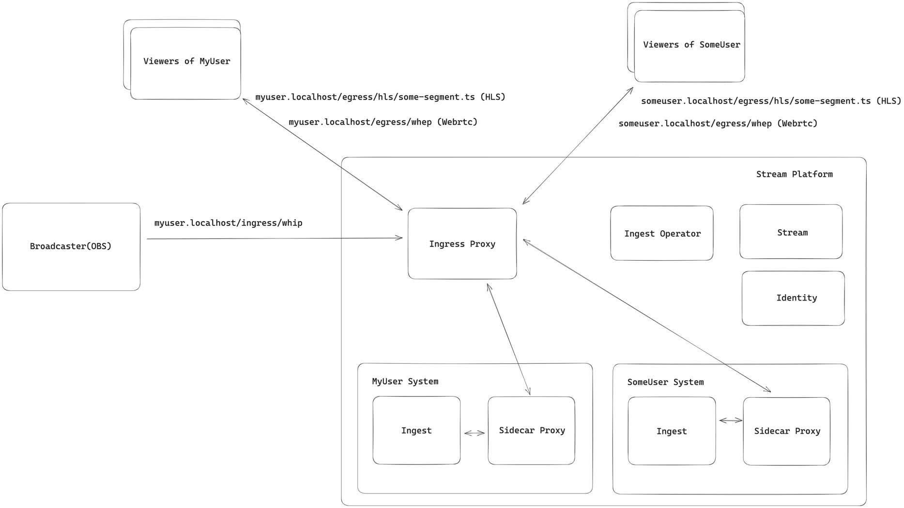
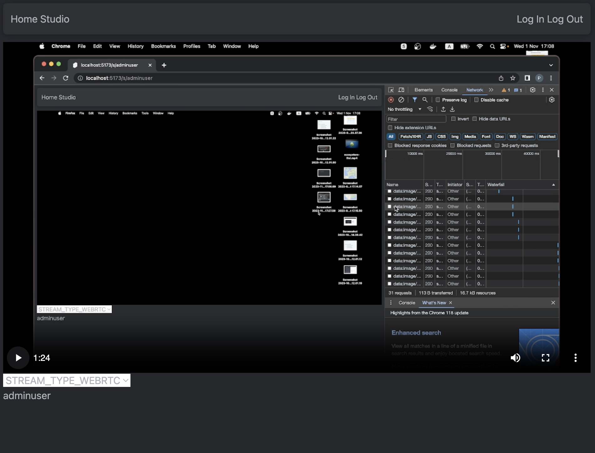
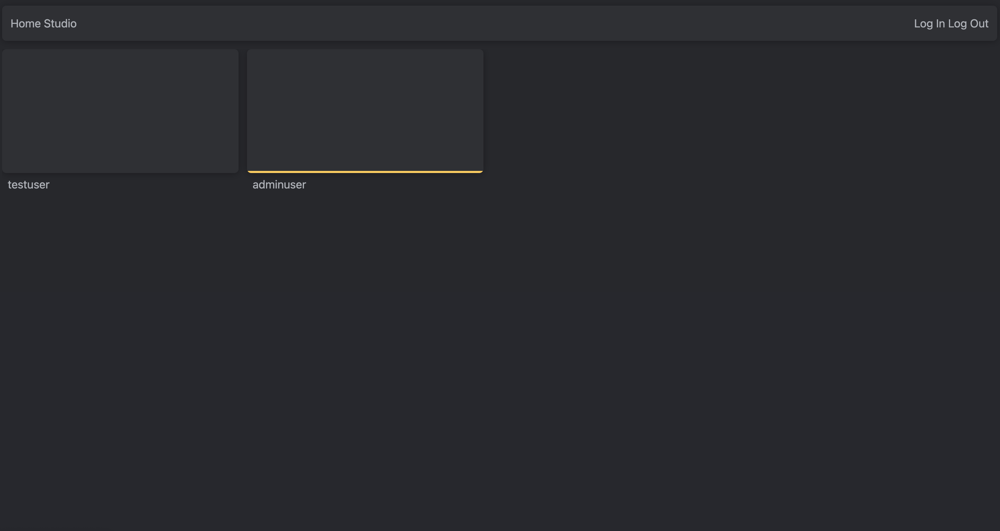

### Build

#### Standalone docker
> [!WARNING]
> Tested on linux 6 cores and 8gb ram.
> Running it on less performant hardware may lead incorrect behavior. (Better build it by hand)

Build all services:

```bash
REGISTRY=localhost:50000 docker-compose -f docker-compose.standalone.yml up
```

Run migration:

```bash
REGISTRY=localhost:50000 docker-compose -f docker-compose.standalone.migrate.yml up
```

Start broadcasting (In that case start ffmpeg) or use OBS 30.0.0 (at 1 Nov 2023 / Stable release: 29.1.3) with Service: `WHIP` and Server: `http://localhost:8089/api/ingress/whip`:

```bash
REGISTRY=localhost:50000 docker-compose -f docker-compose.webrtc.client.yml up
```

Then go to `http://localhost:4173/login` and enter `adminuser` as **username** and **password**.

After that you can access the `http://localhost:4173/dashboard/user` and press `Go live` button.

Now your stream available on home page or at `http://localhost:4173/s/adminuser`.

### Platform architecture

> [!IMPORTANT]
> Partial implemented



- More about ingest can be found at [services/ingest](https://github.com/romashorodok/stream-platform/tree/main/services/ingest)

#### Components
- Ingest - the processing unit of broadcaster's stream</br>
- Stream - the part where users can get streams and manage their own stream.</br>
- Identity - the part where users can create their own accounts and manage all authentication.</br>
- Ingest operator - the infrastructure part where user can handle own ingest server.</br>
- Client - the frontend where users can start and view streams.

### Screenshots




